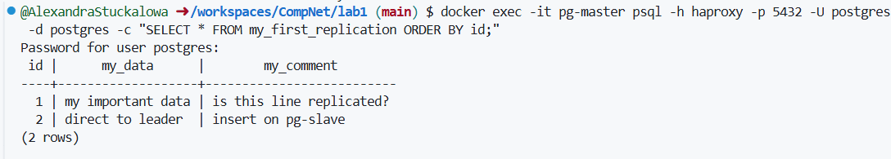
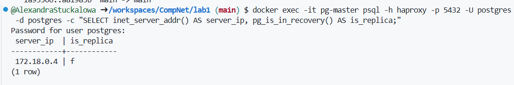
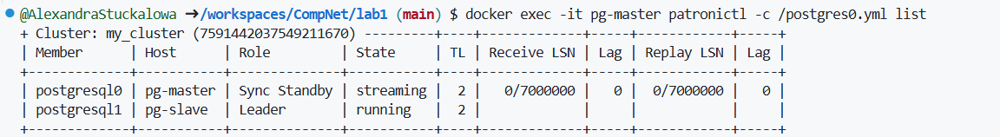
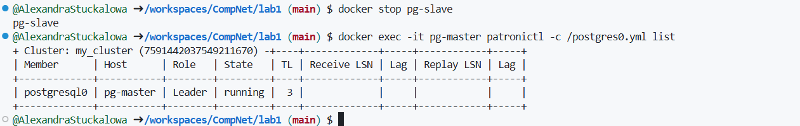
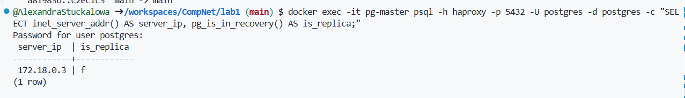
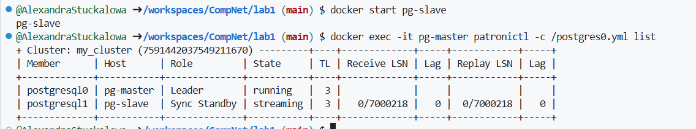

# ЛР1. HA Postgres Cluster (Patroni, Zookeeper, HAProxy)

## Цель
Развернуть кластер PostgreSQL из двух нод с Patroni и Zookeeper, а также настроить вход через HAProxy.

Мы подготовили файлы:
  - `Dockerfile`
  - `docker-compose.yml`
  - `postgres0.yml`
  - `postgres1.yml`
  - `haproxy.cfg`

И запустили кластер при помощи команды:
```bash
docker compose up -d --build
```
## 1 часть: Patroni, Zookeeper, роли, репликация

### Список запущенных контейнеров после запуска docker compose.


### Проверим роли нод Leader и Replica

По выводу Leader - pg-slave, Replica - pg-master

### На лидере создана таблица и добавлена запись:


### Проверка репликации
Далее мы подключились ко второй ноде pg-master, которая работает как реплика. На реплике выполнили SELECT из таблицы my_first_replication.  В результате отобразилась та же строка, что и на лидере. Из этого делаем вывод, что репликация  работает. 

Затем попробовали выполнить INSERT на реплике и получили ошибку "cannot execute INSERT in a read-only transaction". Это значит, что реплика находится в режиме чтения, как и должно быть в HA-кластере.


## 2 часть: Настраиваем HAProxy

Чтобы подключаться к кластеру по одному адресу, мы добавили контейнер HAProxy. Он проверяет через Patroni, какая нода сейчас является лидером, и направляет подключения на активного лидера. После docker-compose.yml перезапустили проект и контейнер haproxy успешно стартовал.


Мы проверили, что HAProxy работает как единая точка входа. То есть подключились к базе через haproxy:5432 и выполнили SELECT. Запрос вернул актуальные данные из кластера, значит доступ через прокси настроен корректно:



Чтобы убедиться, что HAProxy направляет соединения именно на текущего лидера, выполнили запрос pg_is_in_recovery(). Для лидера значение false (f), потому что лидер работает в обычном режиме, а реплика в режиме recovery. В нашем случае is_replica = f, значит подключение через HAProxy действительно попало на Leader.



Перед имитацией сбоя проверили текущее состояние кластера через patronictl list. Видим текущего лидера и синхронную реплику (Sync Standby):



Затем мы имитировали отказ текущего лидера. Мы остановили контейнер pg-slave. Patroni автоматически выполнил failover, роль Leader перешла к pg-master. В выводе patronictl list видно, что postgresql0  стал Leader, а postgresql1 исчез из списка (то есть нода недоступна).



После failover проверили, что HAProxy продолжает работать как единая точка входа. Мы подключились к PostgreSQL через haproxy:5432 и выполнили запрос pg_is_in_recovery(). Значение false (f) означает, что соединение установлено с текущим лидером. Таким образом, даже после переключения роли Leader подключение через HAProxy остаётся корректным:



После проверки отказоустойчивости вернули вторую ноду в кластер командой docker start pg-slave. Повторно посмотрели состояние кластера через patronictl list и убедились, что pg-master остается лидером, а pg-slave вернулся как синхронная реплика (Sync Standby) в состоянии streaming. Лаг репликации равен 0, значит реплика актуальна:



## Итоговый вывод по лабораторной работе

В ходе данной лабораторной работы нами был развернут отказоустойчивый кластер PostgreSQL из двух нод с использованием Patroni и ZooKeeper. Была проверена репликация: данные, записанные на лидере, появлялись на второй ноде, а попытка записи на standby завершалась ошибкой из-за режима только чтение. 

Далее был настроен HAProxy как единая точка входа в кластер и подтверждено, что подключения направляются на текущего лидера. Также был смоделирован отказ лидера: после остановки ноды Patroni автоматически выполнил failover, лидер переключился на вторую ноду, при этом подключение через HAProxy продолжило работать корректно. После запуска остановленной ноды кластер восстановился до состояния Leader + Sync Standby, реплика догнала лидера (lag = 0).

## Ответы на вопросы 