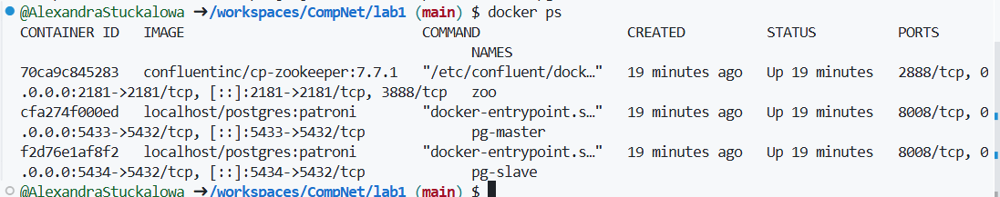
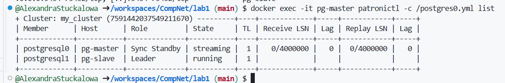
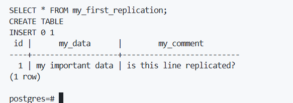
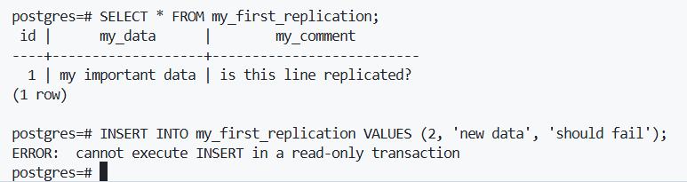
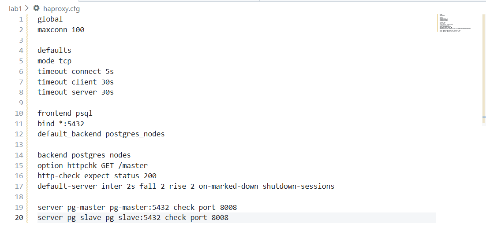
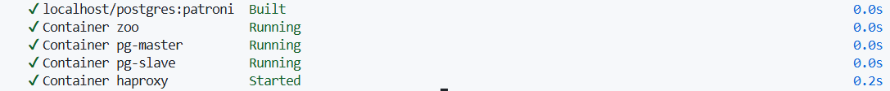

# ЛР1. HA Postgres Cluster (Patroni, Zookeeper, HAProxy)

## Цель
Развернуть кластер PostgreSQL из двух нод с Patroni + Zookeeper и настроить единый вход через HAProxy.

Мы подготовили файлы:
  - `Dockerfile`
  - `docker-compose.yml`
  - `postgres0.yml`
  - `postgres1.yml`
  - `haproxy.cfg`

И запустили кластер при помощи команды:
```bash
docker compose up -d --build
```
## 1 часть: Patroni, Zookeeper, роли, репликация

### Список запущенных контейнеров после запуска docker compose.


### Проверим роли нод Leader и Replica

По выводу Leader - pg-slave, Replica - pg-master

### На лидере создана таблица и добавлена запись:


### Проверка репликации
Далее мы подключились ко второй ноде pg-master, которая работает как реплика. На реплике выполнили SELECT из таблицы my_first_replication.  В результате отобразилась та же строка, что и на лидере. Из этого делаем вывод, что репликация  работает. 

Затем попробовали выполнить INSERT на реплике и получили ошибку "cannot execute INSERT in a read-only transaction". Это значит, что реплика находится в режиме чтения, как и должно быть в HA-кластере.



## 2 часть: Настраиваем HAProxy

Чтобы подключаться к кластеру по одному адресу, мы добавили контейнер HAProxy. Он проверяет через Patroni, какая нода сейчас является лидером, и направляет подключения на активного лидера. После docker-compose.yml перезапустили проект и контейнер haproxy успешно стартовал.


