## Часть 1. Логирование

1. Создадим первые два Yaml файла конфигурации: `docker-compose.yml` и `promtail_config.yml`
   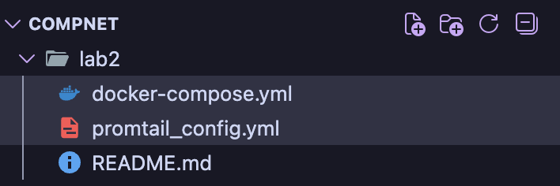
2. Поднимем контейнеры командой `docker compose up -d`
   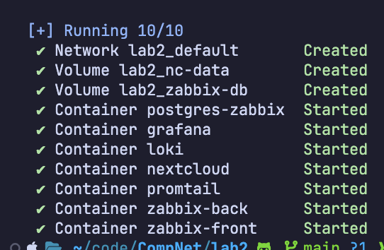
3. Подключаемся к веб-интерфейсу nextcloud через `localhost:8080`
   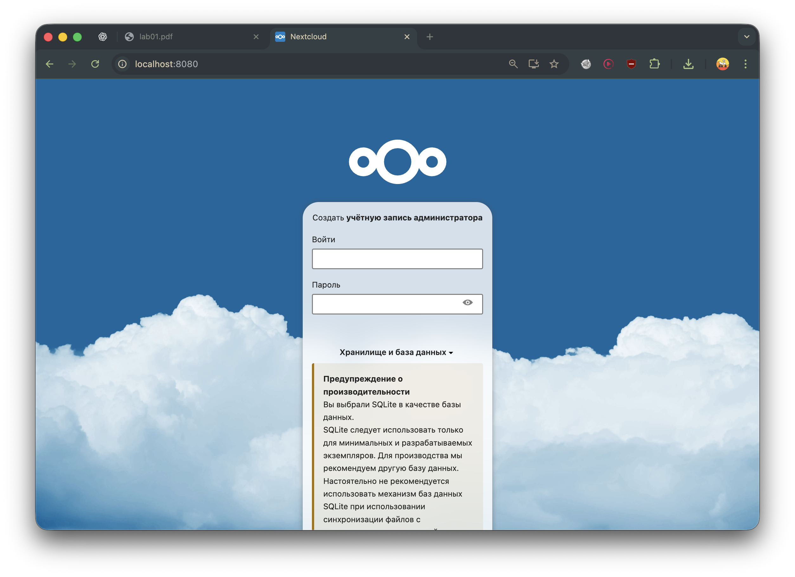
4. Регистрируем учетку пользователя в системе и проверяем логи

```bash
docker exec -it ea32d8a1744b /bin/bash
cat data/nextcloud.log
```

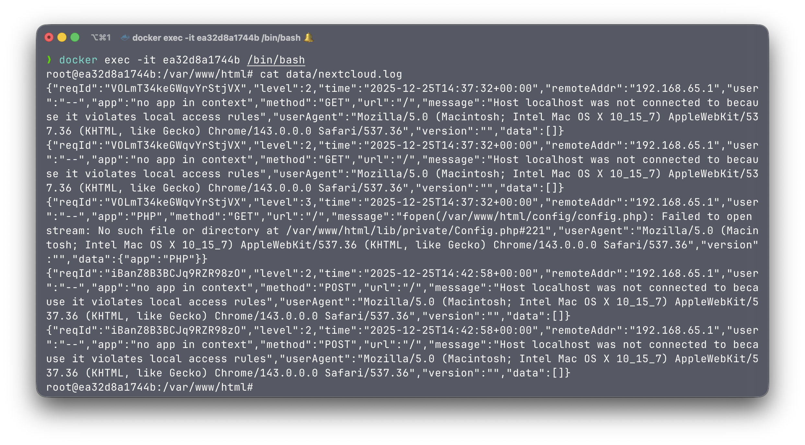  
5. Проверяем, что promtail подцепил `nextcloud.log`
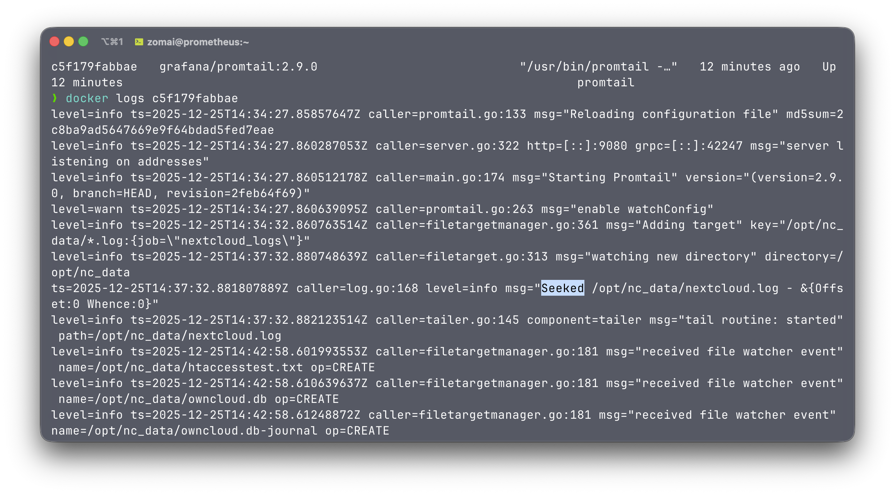

## Часть 2. Мониторинг

1. Откроем веб-интерфейс zabbix через `localhost:8082`
   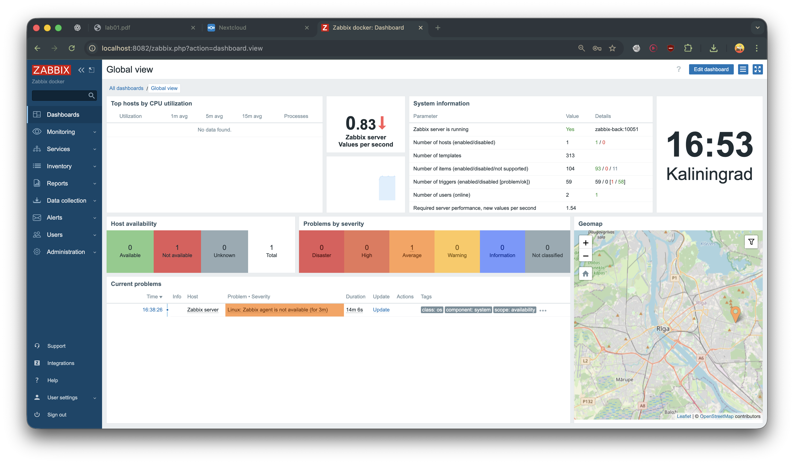
2. Создадим файл template.yml
3. В разделе data collection / templates / import импортируем созданный файл
   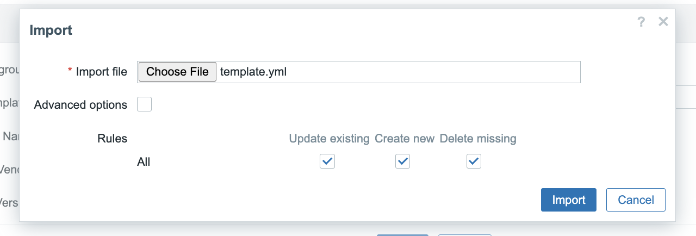
   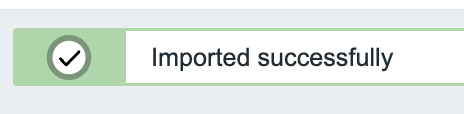
4. Разрешим короткое имя в некстклауде
   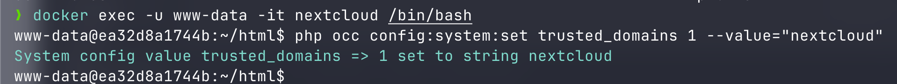
5. В разделе data collection / hosts / new host создадим новый хост и выберем импортированный шаблон
   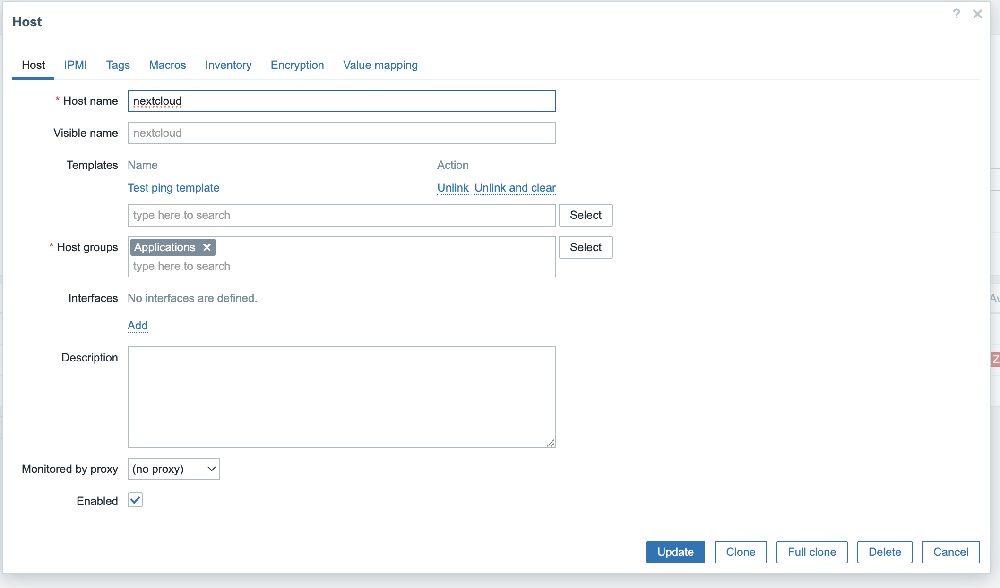
6. В разделе monitoring / latest data проверим, что появились данные
   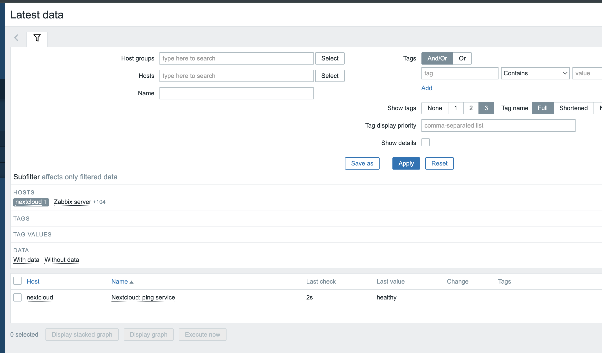

## Часть 3. Визуализация

1. В терминале выполнить команду `docker exec -it grafana bash -c "grafana cli plugins install alexanderzobnin-zabbix-app"`, затем `docker restart grafana`
   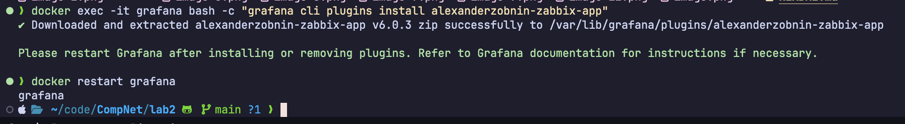
2. Установим плагин Zabbix через веб-интерфейс grafana
   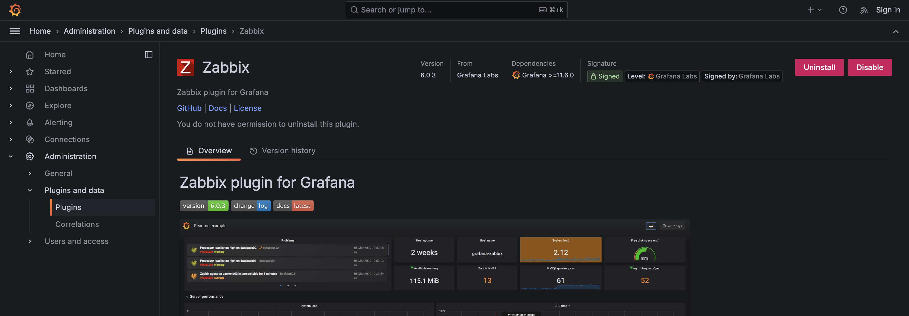
3. Подключаем Loki
   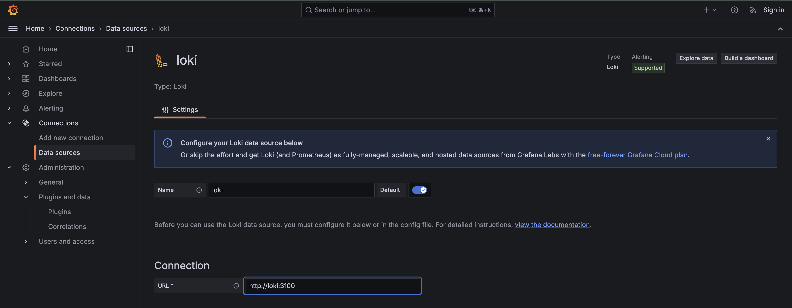
4. Удостовермися что прошли тесты
   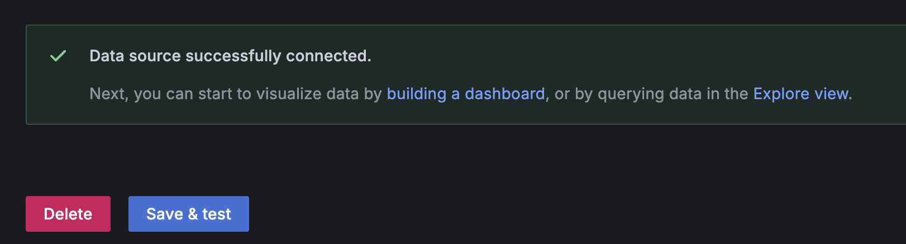
5. Аналогично настраиваем Zabbix
   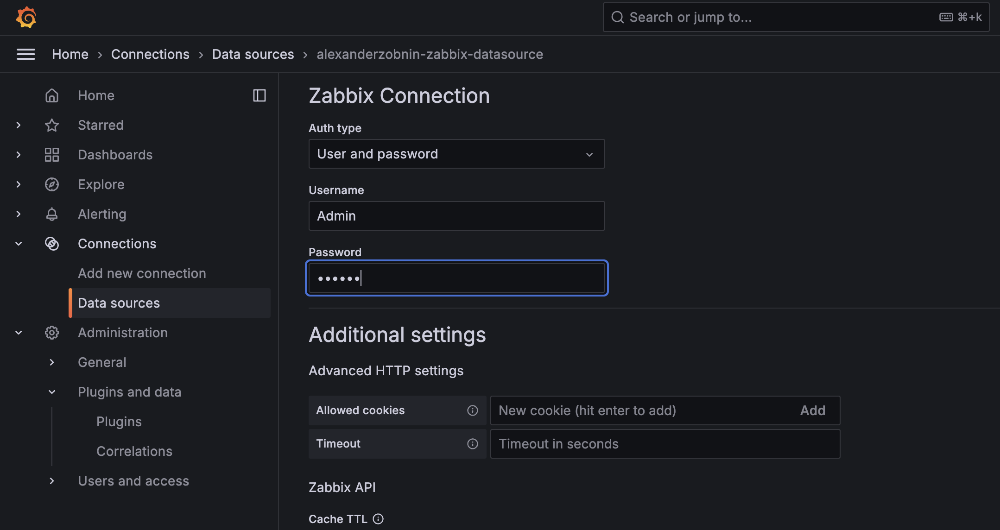
   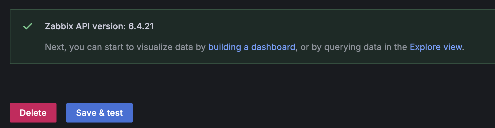
6. Изначально логи zabbix nextcloud не отображались в Grafana, так как в конфигурации Promtail использовалась маска \*.log, и файл nextcloud.log не подхватывался. После замены маски на точный путь /opt/nc_data/nextcloud.log логи начали корректно поступать в Loki и отображаться в Grafana.
   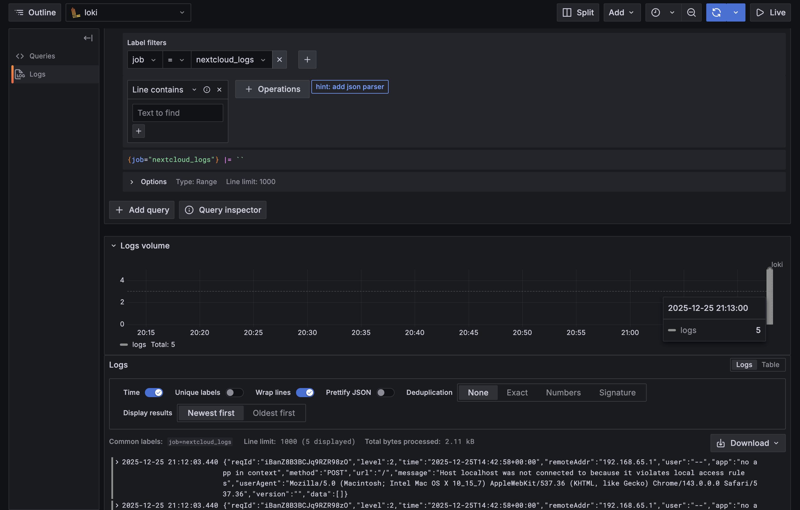
   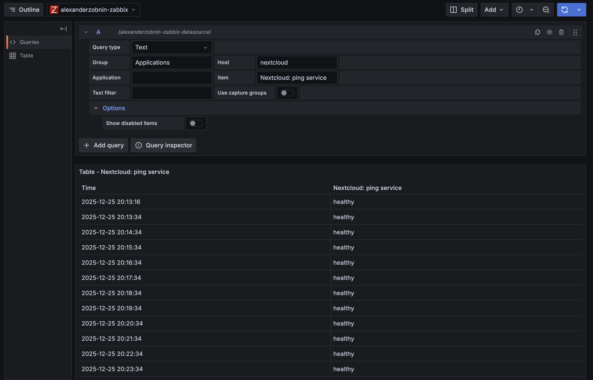

## Задание

1. Дешборд для просмотра uptime некстклауда
   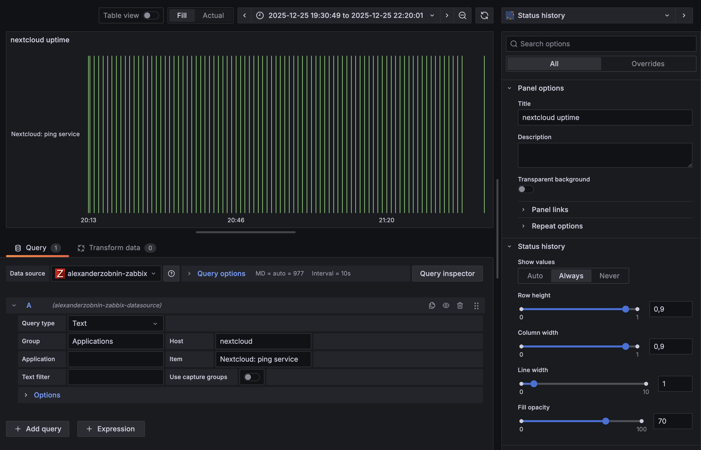
2. Табличка с логами loki
   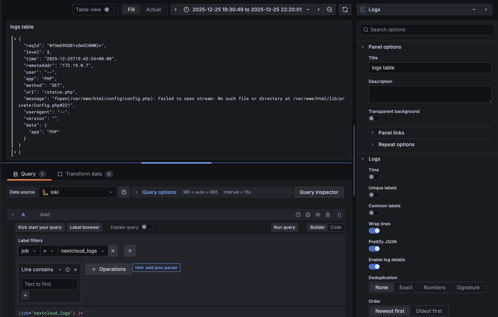
3. Итоговый вид
   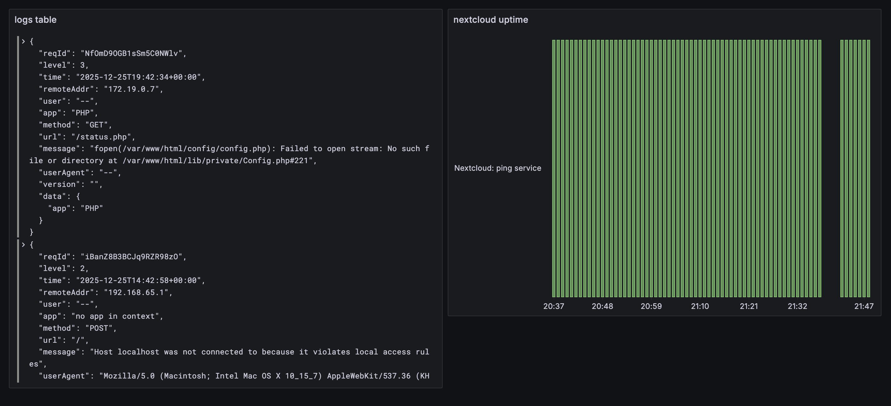

## Ответы на вопросы

### 1.SLO vs SLA

**SLO** - внутренняя цель качества сервиса
**SLA** - формальное соглашение с клиентом с обязательствами и штрафами

### 2. Инкрементальный vs дифференциальный бэкап

**Инкрементальный** - сохраняет изменения с момента последнего бэкапа любого типа
**Дифференциальный** - сохраняет изменения с момента последнего полного бэкапа

### 3. Мониторинг vs observability

**Мониторинг** - показывает, что не работает
**Observability** - помогает понять, почему это не работает

## Вывод

В ходе работы успешно настроена комплексная система мониторинга Nextcloud. Реализовано централизованное логирование через Promtail+Loki, сбор метрик с помощью Zabbix и визуализация данных в Grafana. Решена проблема с корректным сбором логов Nextcloud, созданы информативные дашборды для отслеживания состояния системы и анализа событий.
